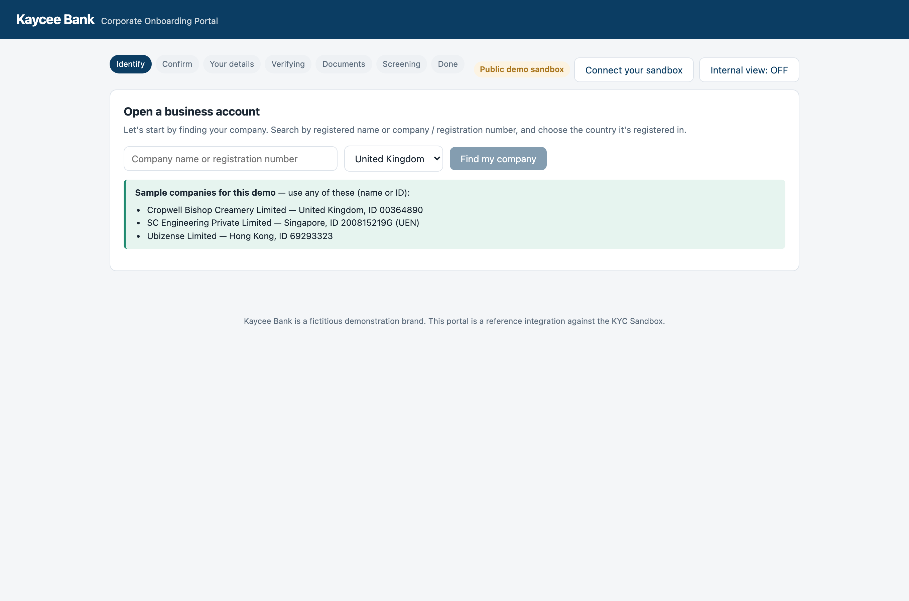

# Kaycee: SME business onboarding sample app

Kaycee is a runnable sample application that shows how to build a customer facing
**SME business onboarding** flow on top of the [Know Your Customer](https://knowyourcustomer.com/developers)
**KYB and UBO API**. It walks a new business customer through opening an account:
find the company, answer an onboarding questionnaire, verify the people who own
and control it, screen them for AML, and submit. It runs against a **free
sandbox**, so you can try the whole journey with no cost and no commitment.

It is built to be forked. The entire API surface lives in one typed client file,
the journey is one readable component, and the extension points are marked in the
code. The goal is simple: read it in twenty minutes, then start replacing the
sample code with yours.

Topics: **KYB** (Know Your Business), **KYC**, **UBO** (ultimate beneficial
ownership), business onboarding, beneficial ownership resolution, AML screening,
company verification, developer sandbox.



## Quickstart

Requires Node.js 20 or later.

```bash
npm install
npm run dev
```

Open <http://localhost:3000>. With no configuration, the app runs against the
free public sandbox and provisions a throwaway tenant for you, so you can walk
the journey immediately.

### Run it against your own sandbox tenant

To see the same cases you see when you call the API directly, use your own
sandbox credentials:

1. Request free sandbox access at <https://knowyourcustomer.com/developers>. You
   will be emailed a `client_id` and `client_secret`.
2. In the running app, open **Connect your sandbox** (top right) and paste them.
3. The whole journey now runs against your tenant. Your secret is sent once to
   the app server, sealed into an encrypted, HttpOnly session cookie, and is
   never stored in the browser or returned to it.

This "bring your own credentials" mode means one credential works across every
surface: this app, the API directly, and the developer tools on the portal.

## What you can create

The sandbox is preloaded with companies and individuals you can create and run,
including synthetic scenario cases (for example a PEP match or a long processing
delay) and real companies drawn from live registries. The full list is on the
[sandbox test cases](https://knowyourcustomer.com/developers/test-cases/) page.
You create a company by searching for it and then creating it by its exact name.

## The journey

1. **Identify** the company by name or registration number and country.
2. **Confirm** the entity, which creates the case and starts the asynchronous
   build.
3. **Your details**: the onboarding questionnaire, attached to the case as a note.
4. **Verifying**: the app polls until the case is ready. A developer view shows
   the raw API calls and status transitions.
5. **Documents**: identity documents for every individual who controls the
   company (over 25 percent effective ownership, or the directors plus the
   largest controller if none reach 25 percent), plus a board resolution.
6. **Screening**: the automatic AML screening result, read-only.
7. **Done**: the case auto-closes and the close report is available in the
   developer view.

A **developer view** toggle (top right, default on) reveals the API debug stream
and the close report. It is a demo affordance, not authentication. Turn it off to
see the customer-facing journey on its own.

## How it is built

The browser never sees a credential. All API calls go through the Next.js server
route handlers (a backend-for-frontend), which hold the credential, broker a
short-lived bearer token, and proxy the `/v2` API.

```
src/
  lib/brand.ts          re-brand here (name, tagline, theme, one file)
  lib/api-types.ts      shared types, countries, sample companies, questionnaire bands
  lib/ubo.ts            who must verify ID: over-25% owners, else directors + largest
  lib/bff-fetch.ts      browser to our own /api/* (never the API directly)
  server/
    config.ts           configuration (base URL, optional credentials, scope)
    auth.ts             token broker: BYO session, static creds, or demo provision
    session-seal.ts     encrypts the connect-your-sandbox session cookie
    kyc-client.ts       the API map: one typed method per API call
    bff.ts              thin error-translation helper
  app/
    api/...             the backend-for-frontend route handlers
    page.tsx            the page
  components/
    Journey.tsx         the whole onboarding journey in one file
    OrgChart.tsx        recursive ownership-tree renderer
    AmlPanel.tsx        AML screening view, read-only
```

See [`docs/EXTENDING.md`](docs/EXTENDING.md) for the marked extension points
(self-service signup gate, ongoing monitoring, individual cases, your own user
auth, persistence, design system, and replacing the backend-for-frontend with
your own gateway).

## Configuration

Copy `.env.example` to `.env`. The defaults work with no edits.

| Variable | Default | Purpose |
|---|---|---|
| `SANDBOX_BASE_URL` | `https://api.knowyourcustomer.dev` | The API base URL (the free public sandbox). |
| `SANDBOX_CLIENT_ID` / `SANDBOX_CLIENT_SECRET` | blank | Optional. Leave blank for the demo auto-provision path, or set both to pin one fixed tenant. For per-session credentials, prefer the in-app connect screen. |
| `SANDBOX_SCOPE` | `PublicApi` | OAuth scope. |
| `SESSION_SECRET` | insecure dev fallback | Set a long random string in any real deployment. Encrypts the connect-your-sandbox session cookie. |

## Links

- Developer portal: <https://knowyourcustomer.com/developers>
- API reference: <https://knowyourcustomer.com/developers/api-reference/>
- Free sandbox: <https://knowyourcustomer.com/developers/sandbox/>
- Sandbox test cases: <https://knowyourcustomer.com/developers/test-cases/>

## License

MIT. See [`LICENSE`](LICENSE). Copyright 2026 Know Your Customer Limited.

## Notes

- No charges. Sandbox cases come from a preloaded catalogue; nothing calls a live
  registry or incurs a fee.
- The sandbox is for evaluation and development. Sandbox data and reports are not
  for production compliance use.
- This is a readable reference, not a production-hardened product. Session state
  is in-process; see `docs/EXTENDING.md`.
